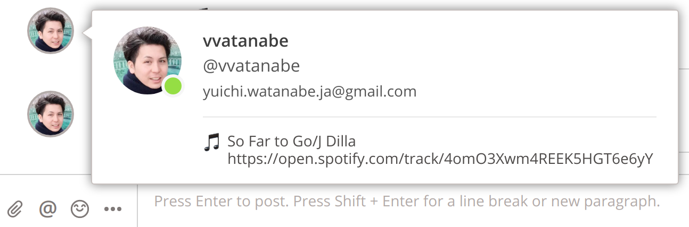
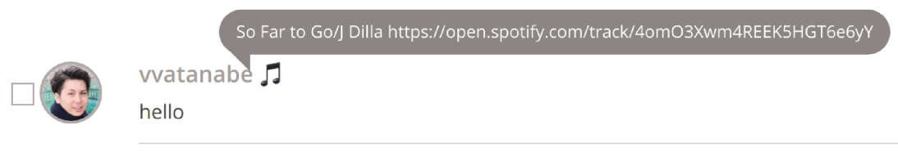

# nowplaying-on-typetalk 

A tool to display the song currently playing on Spotify in Typetalk status.

# How does it works

You access to https://nowplaying-on-typetalk.herokuapp.com/ 

Then you click the login button (you need have a typetalk account)

After you login, a spotify login button is shown on loggedin page.
If you already login to spotify on this page, updating your status starts automatically.

# Original CLI tool

This tool is originally from [typetalk-gadget/nowplaying-on-typetalk](https://github.com/typetalk-gadget/nowplaying-on-typetalk)

